<p align="center">
  
</p>

<h1 align="center">VoxLibris</h1>

<p align="center">
  <strong>Self-hosted AI audiobook creator — turn ebooks into expressive, multi-voice audiobooks</strong>
</p>

<p align="center">
  <a href="#features">Features</a> •
  <a href="#screenshots">Screenshots</a> •
  <a href="#quick-start">Quick Start</a> •
  <a href="#supported-tts-engines">TTS Engines</a> •
  <a href="#how-it-works">How It Works</a> •
  <a href="#configuration">Configuration</a> •
  <a href="#tts-engine-api">Engine API</a> •
  <a href="#cost-comparison">Cost Comparison</a> •
  <a href="#docs">Docs</a>
</p>

<p align="center">
  
  
  
</p>

---

VoxLibris transforms plain text and EPUB files into full-length, multi-voice audiobooks with automatic speaker detection, emotion analysis, and chapter-aware M4B export. It runs entirely on your own infrastructure — no per-character fees, no cloud lock-in, no usage caps.

Upload an ebook, and VoxLibris will:

1. **Parse and segment** the text into chapters, sections, and audio-sized chunks
2. **Detect speakers** — identify dialogue, attribute it to characters, and separate narration
3. **Assign emotions** — label each chunk with one of 14 emotions (happy, tense, angry, tender, etc.)
4. **Generate audio** — render speech using any connected TTS engine with per-character voices
5. **Export** — produce M4B audiobooks with embedded chapter markers, or MP3/ZIP

## Features

- **EPUB & text import** — Upload `.epub` files with automatic chapter extraction, or paste/upload plain text
- **AI-powered speaker detection** — Five detection strategies: explicit dialogue tags, compound name handling, pronoun resolution, narrative context, and turn-taking inference
- **14-emotion analysis** — Each chunk is labeled with an emotion (neutral, happy, sad, angry, fearful, surprised, tender, excited, tense, amused, calm, bored, contemptuous, disgusted) that shapes how the TTS engine renders it
- **Multi-voice output** — Assign different voices to the narrator and each detected character
- **Engine-agnostic architecture** — Plug in any TTS engine that implements two REST endpoints. Swap between Chatterbox, XTTSv2, StyleTTS2, Edge TTS, and more without touching application code
- **Voice cloning** — Upload a short audio sample and clone it as a character voice (engine-dependent)
- **Hierarchical project editor** — Book → Chapter → Section → Chunk tree with cascading settings overrides at every level
- **Per-chunk control** — Override speaker, emotion, voice, speed, pitch, and engine for any individual chunk and regenerate just that segment
- **Emotion prosody weights** — Fine-tune how each emotion maps to pitch, speed, volume, and intensity adjustments per engine
- **Customizable parsing prompt** — Edit the LLM system prompt used for text chunking and speaker identification to handle unusual formats
- **Background job queue** — Generation runs asynchronously with real-time progress tracking; listen to completed chunks while the rest generate
- **Export formats** — Single MP3, MP3-per-chapter ZIP, or M4B with embedded chapter markers and metadata
- **Multi-user with data isolation** — User accounts with private projects, voices, and jobs; shared or private TTS engines; invite-only or open registration
- **Built-in docs** — In-app documentation accessible from the header

## Screenshots

| | |
|:---:|:---:|
| 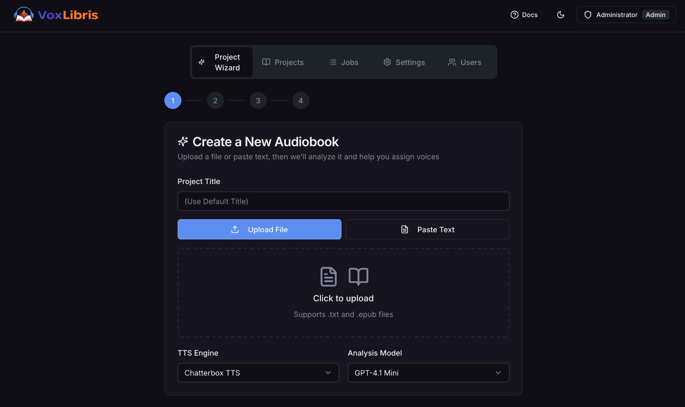 | 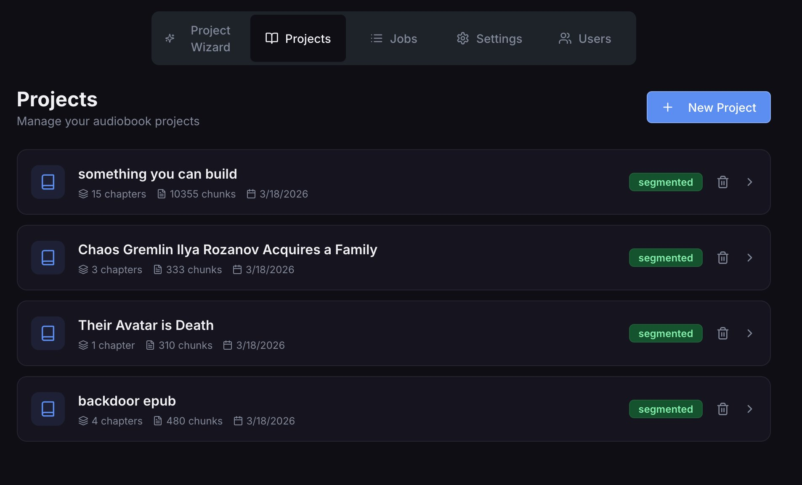 |
| **Project Wizard** — Upload an ebook or paste text, choose a TTS engine and analysis model | **Projects List** — Browse all your audiobook projects with chapter/chunk counts and status |
| 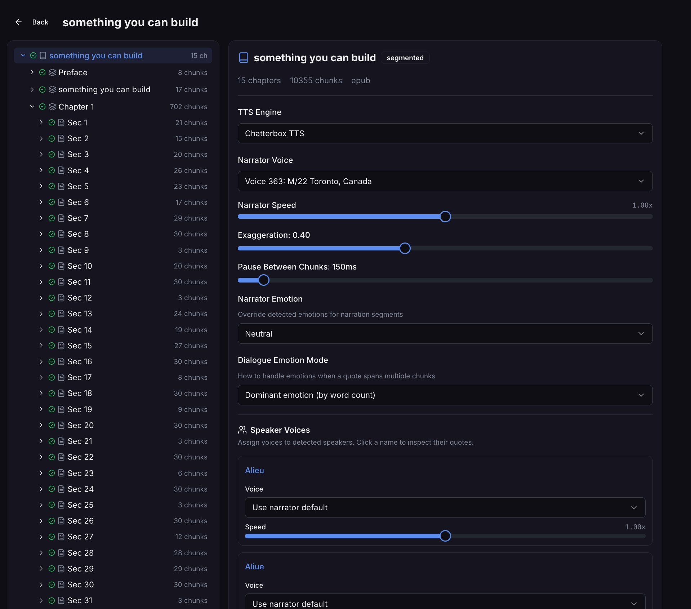 | 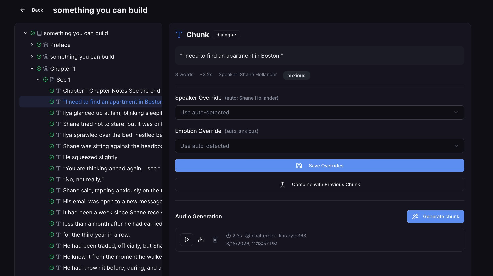 |
| **Project Editor** — Two-panel layout with the full Book → Chapter → Section → Chunk tree and per-speaker voice assignment | **Chunk Detail** — View a chunk's text, auto-detected speaker and emotion, override either, regenerate audio, or combine with adjacent chunks |
| 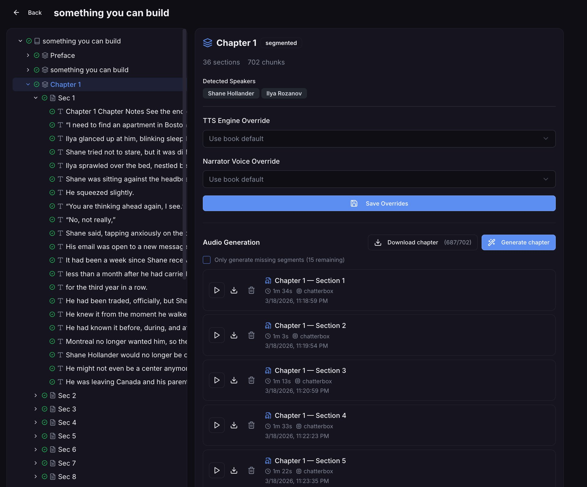 | 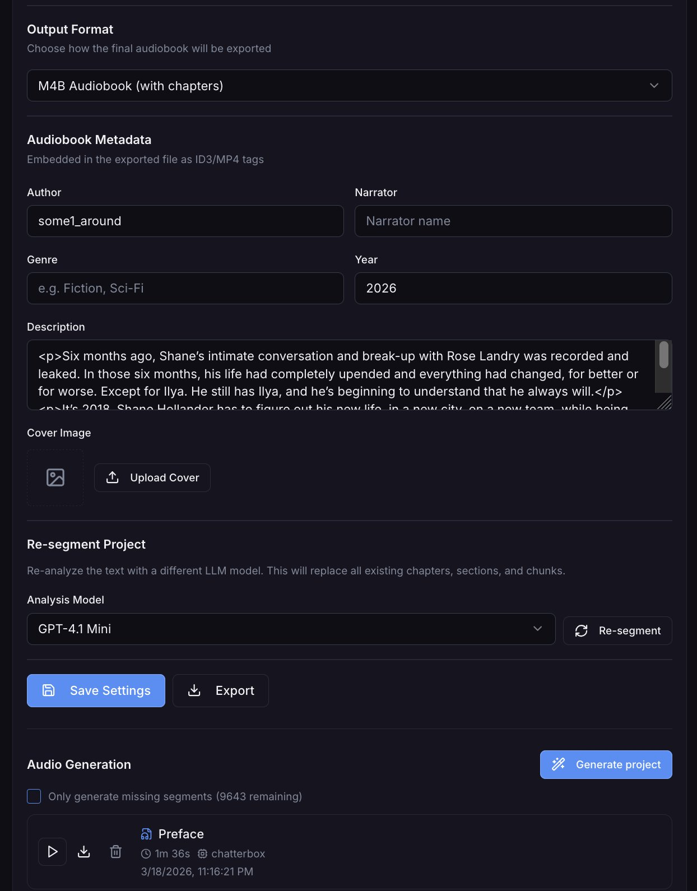 |
| **Chapter View** — See detected speakers, override engine/voice at the chapter level, download or generate chapter audio with section-by-section progress | **Audiobook Metadata** — Set author, narrator, genre, year, description, and cover image for M4B export; re-segment with a different LLM model |
| 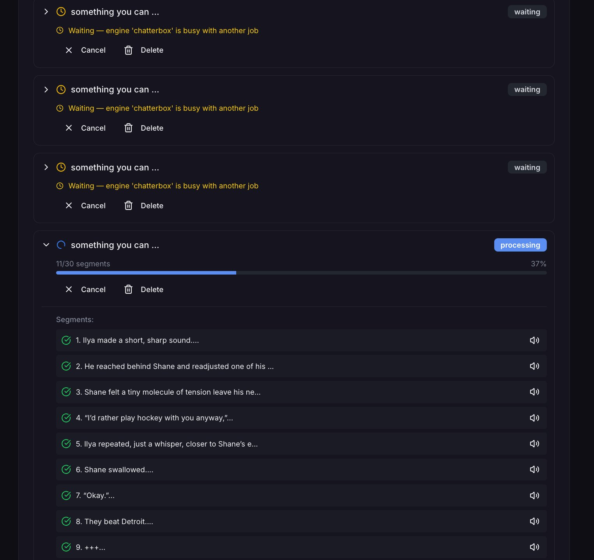 | 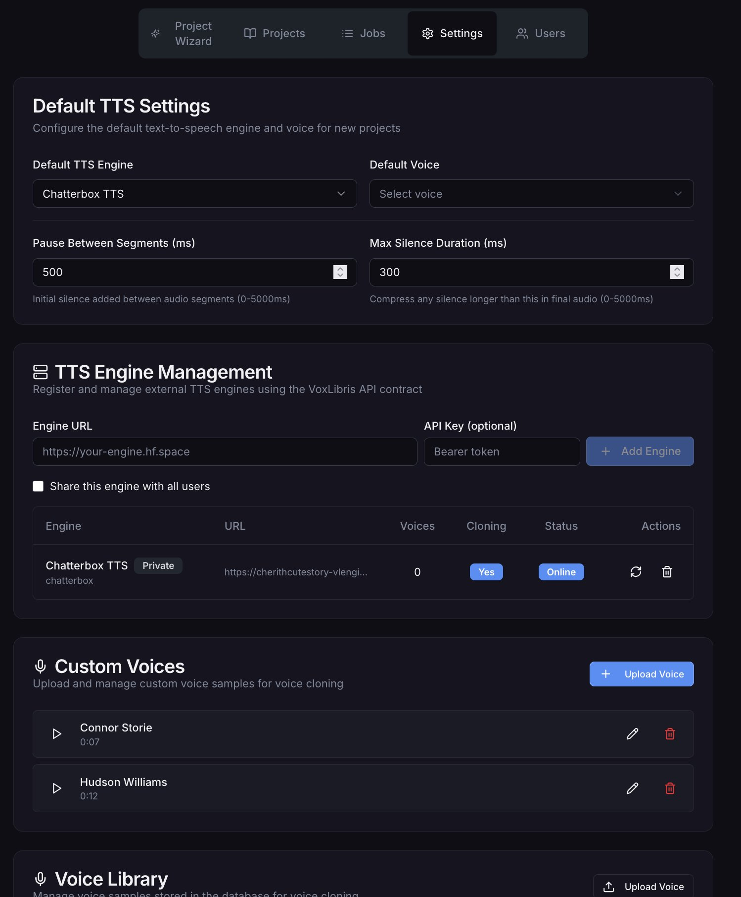 |
| **Jobs Queue** — Real-time progress tracking for generation jobs with per-segment status, playback, and waiting/processing states | **Settings** — Configure default TTS engine and voice, register remote engines, manage custom voice samples for cloning |
| 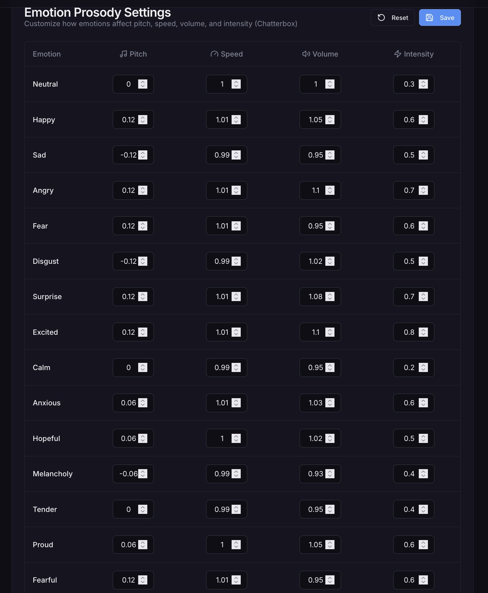 | 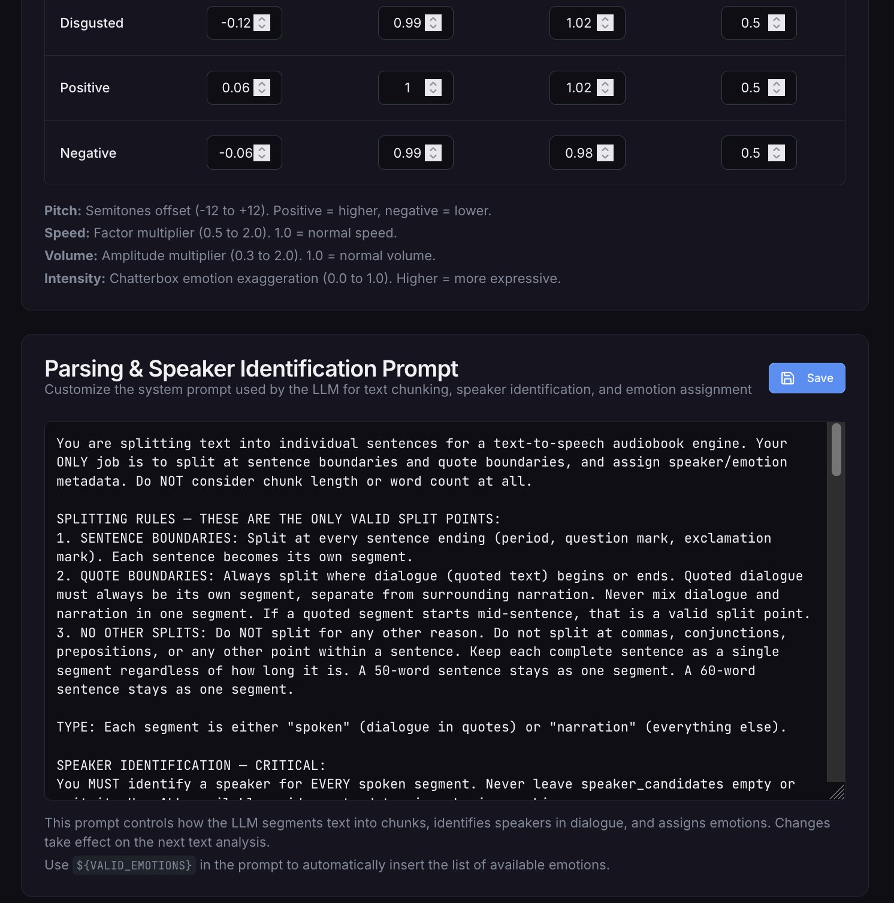 |
| **Emotion Prosody Settings** — Fine-tune how each of the 14+ emotions maps to pitch, speed, volume, and intensity per engine | **Parsing Prompt** — Fully editable LLM system prompt for text chunking, speaker identification, and emotion assignment |
| 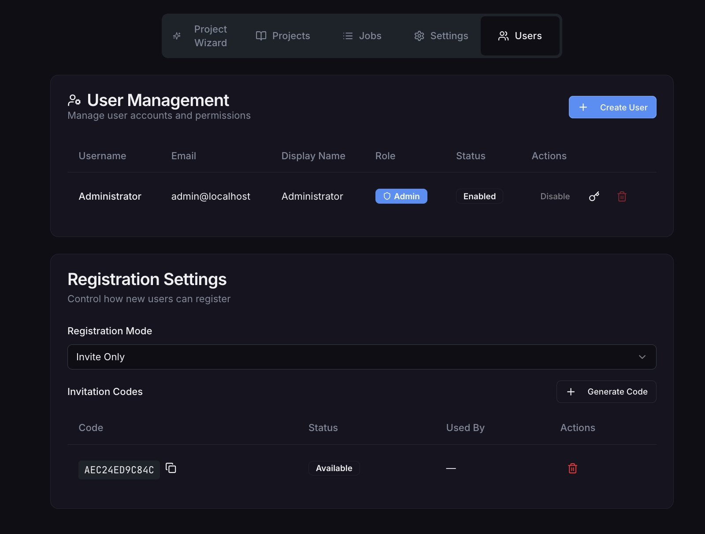 | |
| **User Management** — Admin panel with user accounts, role management, and invite-only registration with generated codes | |

## Quick Start

### Prerequisites

- Python 3.11+
- PostgreSQL
- A TTS engine (see [Supported TTS Engines](#supported-tts-engines))
- An OpenRouter API key (for LLM-based text analysis)

### Docker Compose (Recommended)

```yaml
version: "3.8"
services:
  voxlibris:
    image: ghcr.io/yourusername/voxlibris:latest
    ports:
      - "8080:8080"
    environment:
      - DATABASE_URL=postgresql://voxlibris:secret@db:5432/voxlibris
      - OPENROUTER_API_KEY=your-key-here
    depends_on:
      - db

  db:
    image: postgres:16
    environment:
      - POSTGRES_USER=voxlibris
      - POSTGRES_PASSWORD=secret
      - POSTGRES_DB=voxlibris
    volumes:
      - pgdata:/var/lib/postgresql/data

volumes:
  pgdata:
```

```bash
docker compose up -d
```

Then open `http://localhost:8080` and log in with the default credentials (`Administrator` / `ChangeMe`).

> **⚠️ Change the default password immediately** via the user menu in the top-right corner.

### Connecting a TTS Engine

1. Go to **Settings** → **TTS Engine Management**
2. Enter your engine's URL (e.g., your HuggingFace Space endpoint)
3. Click **Add Engine** — VoxLibris will auto-discover the engine's capabilities
4. The engine appears in the engine table with its status, voice count, and cloning support

## Supported TTS Engines

VoxLibris uses a plugin architecture — any service implementing the [TTS Engine API contract](#tts-engine-api) works out of the box.

| Engine | Type | Voice Cloning | Emotion Support | Notes |
|--------|------|:---:|:---:|-------|
| **[Chatterbox](https://github.com/resemble-ai/chatterbox)** | Remote (GPU) | ✅ | ✅ | Expressive synthesis with exaggeration control; beats ElevenLabs in blind tests |
| **[XTTSv2](https://github.com/coqui-ai/TTS)** | Remote (GPU) | ✅ | Via prosody | Multilingual voice cloning |
| **[StyleTTS2](https://github.com/yl4579/StyleTTS2)** | Remote (GPU) | ✅ | Via diffusion presets | Style-transfer TTS |
| **[Qwen2.5/3-TTS](https://github.com/QwenLM/Qwen2.5-TTS)** | Remote (GPU) | ✅ | Via instruct prompts | Chinese/English neural TTS |
| **[OpenVoice V2](https://github.com/myshell-ai/OpenVoice)** | Remote (GPU) | ✅ | Via prosody | Voice conversion and cloning |
| **[IndexTTS2](https://github.com/indexteam/IndexTTS2)** | Remote (GPU) | ✅ | Via prosody | Indexed voice TTS |
| **Edge TTS** | Built-in (cloud) | ❌ | Partial (SSML) | Microsoft Azure neural voices — 80+ languages, no GPU required |
| **Soprano** | Built-in (local) | ❌ | ❌ | Ultra-fast local generation for quick previews |

### Running Engines on HuggingFace Spaces

The easiest way to run GPU-accelerated engines is on [HuggingFace Spaces](https://huggingface.co/spaces). Wrap your TTS model in a small FastAPI server that implements `POST /GetEngineDetails` and `POST /ConvertTextToSpeech`, deploy it as a Space with GPU, and point VoxLibris at the Space URL.

VoxLibris handles cold-start warm-up automatically — it polls the engine and shows a progress indicator until the Space is ready.

## How It Works

### Text Analysis Pipeline

When you upload text or an EPUB, VoxLibris sends it through an LLM (via OpenRouter) that:

1. **Segments** the text into sections of ~30 chunks each
2. **Splits** each section into individual chunks at sentence and quote boundaries
3. **Classifies** each chunk as `dialogue` or `narration`
4. **Identifies speakers** for dialogue using five strategies:
   - Explicit named tags (`"Hello," said John`)
   - Compound name normalization (`Detective Chen` → `Chen`)
   - Pronoun resolution with gender and context tracking
   - Narrative context attribution to narrator
   - Turn-taking inference for rapid dialogue exchanges
5. **Labels emotions** from 14 canonical categories based on context

The parsing prompt is fully editable in Settings, so you can customize the behavior for unusual text formats or domain-specific content.

### Audio Generation Pipeline

For each chunk, VoxLibris:

1. Resolves the voice — narrator default, per-speaker assignment, or chunk-level override
2. Resolves the emotion — auto-detected, narrator override, or dialogue flattening
3. Applies prosody weights — maps the emotion to pitch/speed/volume/intensity adjustments
4. Sends the request to the TTS engine with text, voice, emotion, and prosody parameters
5. Post-processes — pitch adjustment (pyrubberband), speed adjustment, silence trimming
6. Saves as MP3 and rolls up into section → chapter audio automatically

### Settings Cascade

Settings override at every level of the hierarchy:

```
Book defaults
  └─ Chapter override
       └─ Section override
            └─ Chunk override (highest priority)
```

This means you can set a default voice for the whole book, override it for a specific chapter, and override again for a single chunk — without touching anything else.

## Configuration

### Environment Variables

| Variable | Required | Description |
|----------|:---:|-------------|
| `DATABASE_URL` | ✅ | PostgreSQL connection string |
| `OPENROUTER_API_KEY` | ✅ | API key for LLM text analysis |
| `SECRET_KEY` | Recommended | Session encryption key (generated if not set) |

### In-App Settings

All other configuration is managed through the Settings UI:

- **Default TTS engine and voice** — Used for new projects
- **Pause between segments** — Silence gap between chunks (0–5000ms)
- **Max silence duration** — Compress silence longer than this in final audio
- **Remote TTS engines** — Register, share, and manage external engines
- **Custom voices** — Upload WAV/MP3 samples for voice cloning
- **Voice library** — Browse and manage VCTK corpus samples
- **Emotion prosody weights** — Per-emotion pitch/speed/volume/intensity per engine
- **Parsing prompt** — LLM system prompt for text analysis
- **LLM model selection** — Choose which model to use via OpenRouter

## TTS Engine API

Any TTS service can integrate with VoxLibris by implementing two endpoints:

### `POST /GetEngineDetails`

Returns engine capabilities, available voices, and supported emotions.

```json
{
  "engine_id": "chatterbox-tts",
  "engine_name": "Chatterbox TTS",
  "sample_rate": 24000,
  "bit_depth": 16,
  "channels": 1,
  "max_seconds_per_conversion": 30,
  "supports_voice_cloning": true,
  "builtin_voices": [...],
  "supported_emotions": ["neutral", "happy", "sad", "angry", ...]
}
```

### `POST /ConvertTextToSpeech`

Accepts text, voice selection, emotion, and prosody parameters; returns a PCM WAV file.

```json
{
  "input_text": "The quick brown fox jumped over the lazy dog.",
  "builtin_voice_id": "voice_001",
  "voice_to_clone_sample": null,
  "emotion_set": ["happy", "excited"],
  "intensity": 70,
  "speed_adjust": 1.5,
  "pitch_adjust": -0.5
}
```

Engines handle emotions through three strategies:
- **Native parameter mapping** — Map emotions to engine-specific generation parameters
- **Instruct/prompt-based** — Pass emotion as a text instruction to the model
- **Prosody emulation** — Map emotions to speed/pitch adjustments for engines without native support

See the full [TTS Engine API Contract](docs/tts-api-contract.md) for the complete specification with JSON schemas.

## Cost Comparison

VoxLibris runs on your own GPU. Here's how the economics compare for producing audiobooks at volume:

| Approach | Cost for a ~80,000 word novel (~8hrs audio) | Monthly cost at 4 books/month |
|----------|---:|---:|
| **ElevenLabs Pro** ($99/mo) | ~$99+ (500K chars included, overages at $0.24/1K) | $200–400+ |
| **ElevenLabs Scale** ($330/mo) | ~$330 (2M chars included) | $330+ |
| **Human narrator** | $800–4,000 (at $100–500/finished hour) | $3,200–16,000 |
| **VoxLibris + A10G** ($1/hr GPU) | ~$4–6 (4–6 hours of GPU time) | ~$16–24 |
| **VoxLibris + L40S** ($1.80/hr GPU) | ~$5–9 (3–5 hours, faster generation) | ~$20–36 |

The more you produce, the wider the gap. VoxLibris has no per-character metering, no monthly caps, and no credit system.

## Docs

Full documentation is available in-app (click **Docs** in the header) and in the `docs/` directory:

- [Getting Started](docs/01-getting-started.md)
- [Project Wizard](docs/02-project-wizard.md)
- [Project Editor](docs/03-project-editor.md)
- [Voice Selection](docs/04-voices.md)
- [Audio Generation & Jobs](docs/05-audio-generation.md)
- [Export](docs/06-export.md)
- [Speaker Detection](docs/07-speaker-detection.md)
- [Emotion & Prosody](docs/08-emotion-prosody.md)
- [Settings](docs/09-settings.md)
- [Administration](docs/10-admin.md)
- [Tips & Shortcuts](docs/11-tips-shortcuts.md)
- [TTS Engine API Contract](docs/tts-api-contract.md)

## Contributing

Contributions are welcome! Please open an issue first to discuss what you'd like to change.

## License

[MIT](LICENSE)
